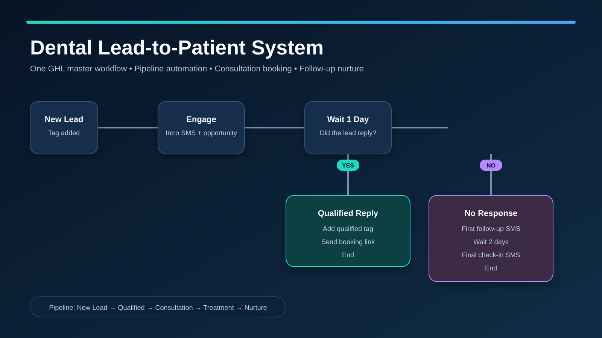
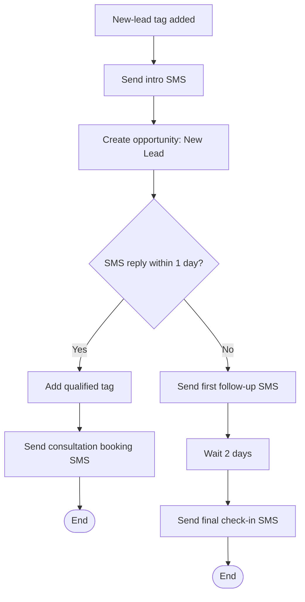

# Dental Lead-to-Patient Automation System

A portfolio-ready GoHighLevel implementation that captures dental leads, opens an opportunity, qualifies replies, routes prospects to a consultation calendar, and follows up automatically when no reply is received.

## System overview

## What was built

- One master workflow: `PORTFOLIO | DENTAL | MASTER SYSTEM`
- Trigger: contact tag `portfolio | dental | new lead`
- Immediate dental-service qualification SMS
- Opportunity creation in `PORTFOLIO | Dental Lead-to-Patient`
- One-day reply wait with reply and timeout paths
- Qualified-contact tagging and consultation booking SMS
- Two-day no-response follow-up sequence
- Personal booking calendar: `PORTFOLIO | Dental Consultation`
- Eight-stage lead-to-patient pipeline
- Premium two-step GHL funnel with a responsive landing page and confirmation page

## Funnel experience

### Dental consultation landing page

[Open the GHL preview](https://sites.leadconnectorhq.com/preview/oeJ6Wx9hXhrOwmxk936R?notrack=true)

- Premium responsive hero and strong booking CTA
- Cosmetic, preventive, and restorative service cards
- Patient trust statistics and testimonials
- FAQ and final consultation CTA
- All booking buttons connected to the dental consultation calendar

### Appointment confirmation page

[Open the GHL preview](https://sites.leadconnectorhq.com/preview/xem1UPniD87iTbeasw13?notrack=true)

- Branded consultation confirmation experience
- Three-step “What happens next?” guidance
- Appointment-management CTA
- Return path to the main landing page
- Responsive desktop and mobile layout

## Pipeline stages

1. New Lead
2. Attempting Contact
3. Qualified
4. Consultation Booked
5. Consultation Confirmed
6. Consultation Completed
7. Treatment Accepted
8. Long-Term Nurture

## Workflow logic

## Portfolio screenshots

Screenshots are stored in [`screenshots/`](screenshots/). The intended presentation order is:

1. Master workflow overview
2. Workflow core and reply/timeout branches
3. Dental lead-to-patient pipeline
4. Consultation booking calendar
5. Reply-branch booking SMS
6. Timeout follow-up sequence

## Safety and deployment status

The workflow is intentionally saved as **Draft**. Publishing is deferred until a controlled test contact and an approved sending number are available, preventing accidental live SMS delivery.

## Skills demonstrated

GoHighLevel workflow architecture, conditional branching, SMS automation, opportunity management, pipeline design, calendar configuration, lead qualification, nurture logic, and deployment safety.

---

Built as a professional CRM automation portfolio project.
